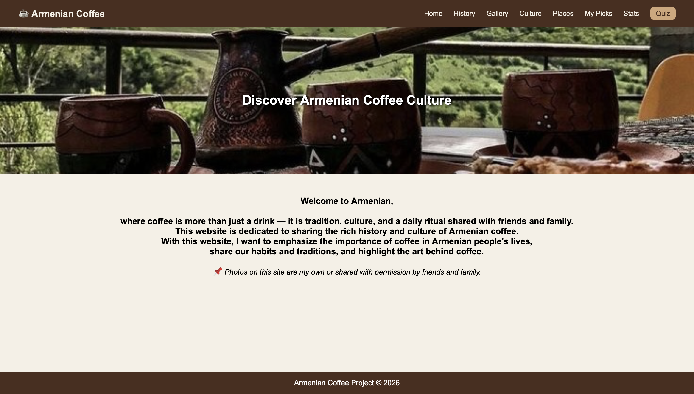
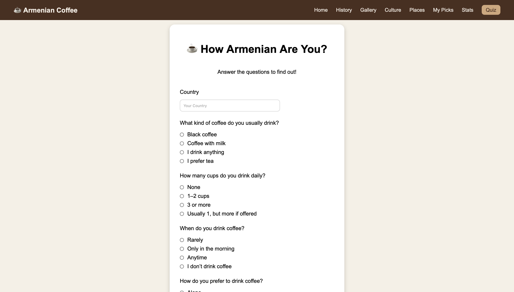
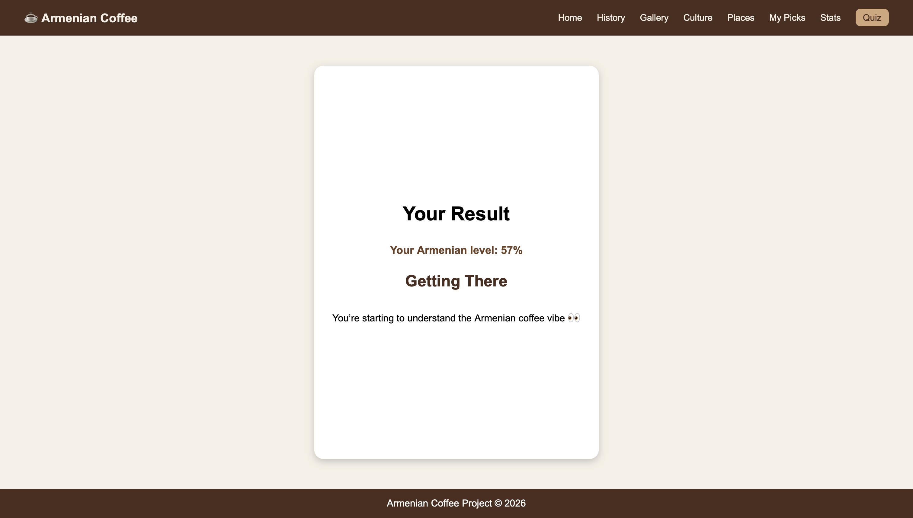
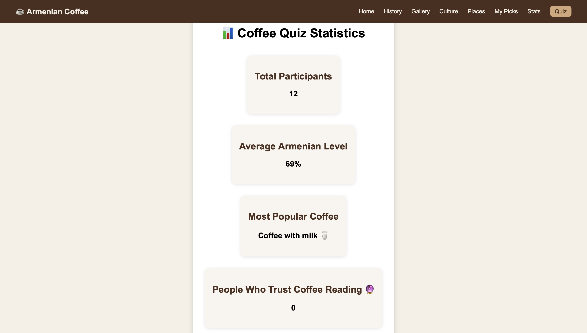

# ☕ Armenian Coffee Culture Website

A full-stack web project about Armenian coffee culture, built using **HTML, CSS, PHP, and MySQL**.

---

## 🌍 About the Project

This website explores the rich traditions of Armenian coffee, including its history, cultural significance, and social role in everyday life.

It also features an interactive quiz that determines how “Armenian” your coffee habits are ☕🇦🇲

---

## 🚀 Features

- 🏠 Multi-page website (Home, History, Culture, Places, Recommendations)
- ☕ Interactive coffee personality quiz
- 🎯 Dynamic result page with percentage score
- 💾 Data storage using MySQL
- 📊 Statistics page based on user responses
- 🎨 Clean and minimal design

---

## 🛠️ Technologies Used

- HTML5
- CSS3
- PHP
- MySQL (phpMyAdmin)
- Apache (XAMPP)

---

## 🎯 Quiz Functionality

Users answer questions about:

- Coffee preferences
- Drinking habits
- Social interactions

The system:

- Calculates a score
- Displays a personalized result
- Stores responses in a database

---

## 📊 Statistics Page

Displays:

- Total participants
- Average Armenian level (%)
- Most popular coffee type
- Coffee reading beliefs

---

## 📸 Screenshots

---

## ⚙️ Setup Instructions

1. Install XAMPP
2. Place the project folder inside: htdocs/
3. Start Apache and MySQL
4. Create a database named: coffee_db
5. Create a table: quiz_results
6. Open in browser: http://localhost/armenian_coffee/

---

## 💡 Future Improvements

- Add charts for statistics
- Improve UI/UX design
- Make the website responsive
- Add more interactive features

---

## 👩‍💻 Author

Sona Nazaryan

---

## 📌 Notes

This project was created for an academic course (_Internet Tools and Services_) and demonstrates basic full-stack web development skills.
